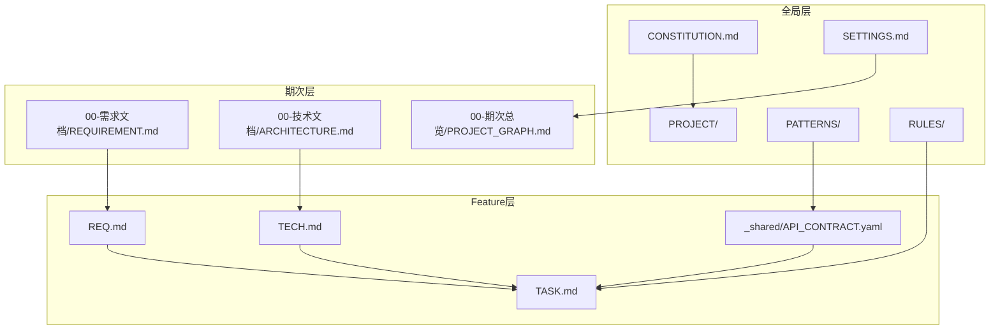

# 项目级整体架构

> 本文档描述 SpecCore 框架的跨期次架构，是框架本身的设计架构。

## 1. 架构总览

SpecCore 采用分层总览架构，将全局资产与期次资产分离，实现知识的持续沉淀和复用。

## 2. 系统架构图

## 3. 技术选型

| 组件 | 技术选型 | 说明 |
| :--- | :--- | :--- |
| 文档格式 | Markdown | 纯文本，不挑工具 |
| 配置格式 | YAML | 接口契约 |
| 脚本 | Bash / Python | 初始化与同步 |
| 版本控制 | Git | 天然支持 |

## 4. 模块划分

| 模块 | 职责 | 路径 |
| :--- | :--- | :--- |
| 命令体系 | 15 个 Slash Command | `templates/commands/` |
| Skill 封装 | 前后端开发流程 | `templates/skills/` |
| 规则模板 | 全局宪法与裁决 | `templates/rules/` |
| Spec 模板 | 全局层 + 期次层 + Feature 层 | `templates/spec/` |
| 脚本 | 初始化与同步 | `scripts/` |

## 5. 演进规划

| 阶段 | 架构变化 | 目标版本 |
| :--- | :--- | :--- |
| 单层结构 | `.ai/` 直接存放全局文件 | v1.x |
| 分层结构 | `.ai/PROJECT/` 目录体系 | v3.0 |
| 配置系统 | `SETTINGS.md` 动态控制 | v3.1 |
