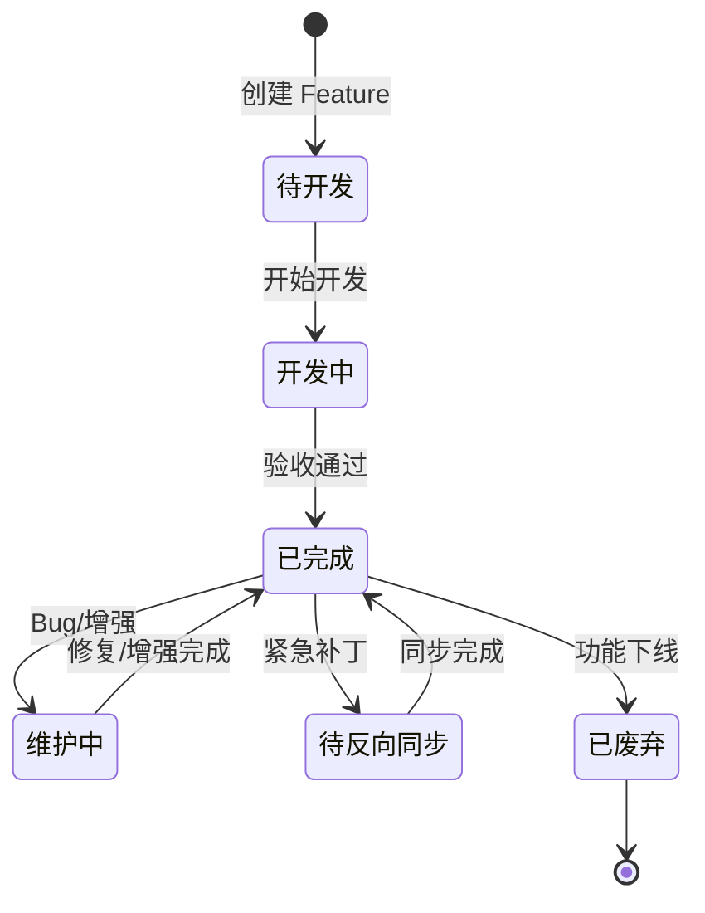

# Feature 完成后的维护流程

> **文档定位**：当 Feature 已签署 `✅ 已完成` 后，本文件定义其线上运行与维护期的标准流程。  
> **适用阶段**：Feature 上线后的整个生命周期。

---

## 1. Feature 状态扩展定义

原有状态 `✅ 已完成` 不足以描述线上运行期间的动态变化。扩展以下状态：

| 状态 | 图标 | 含义 | 触发条件 |
| :--- | :--- | :--- | :--- |
| 已完成 | ✅ | Spec 与代码完全对齐，已上线 | 开发完成 + 验收通过 |
| 待反向同步 | ⚠️ | 代码已改但 Spec 未同步 | 紧急补丁后 |
| 维护中 | 🔄 | 正在回归或功能增强 | 分配维护任务后 |
| 已废弃 | 🚫 | 功能下线，不再维护 | 业务下线 + 代码移除 |

> **PROJECT_GRAPH.md 状态栏已同步扩展以上状态。**

---

## 2. 补丁反向同步流程（⚠️ → ✅）

当 Feature 处于 `⚠️ 待反向同步` 状态时，必须执行以下流程：

### Step 1: 差异分析

AI 读取当前代码，对比以下 Spec 文件，生成差异报告：
- `REQ.md` —— 需求是否仍有代码存在但未描述的逻辑？
- `API_CONTRACT.yaml` —— 接口是否有新增/删除/修改的字段？
- `TASK.md` —— 产出物清单是否与实际代码一致？

### Step 2: 逐项同步

```yaml
# AI 生成的差异报告示例
diff_report:
  - file: REQ.md
    changes:
      - "新增: 登录失败 5 次后锁定 15 分钟"
      - "修改: 错误码 1002 的提示文案从'密码错误'改为'密码错误，还剩 X 次机会'"
  - file: API_CONTRACT.yaml
    changes:
      - "新增字段: remainAttempts (剩余尝试次数)"
      - "修改字段: password.minLength 从 6 改为 8"
  - file: TASK.md
    changes:
      - "新增产出物: LoginAttemptService.java"
```

### Step 3: 更新 Spec

使用 `edit_file` 逐个更新差异项，并在变更履历中追加：

```markdown
| 2026-07-15 | v1.1 | 反向同步补丁: 同步线上紧急修复内容 | AI-Assistant |
```

### Step 4: 更新图谱状态

将 `PROJECT_GRAPH.md` 中该 Feature 状态从 `⚠️` 改回 `✅`。

---

## 3. Bug 修复流程（✅ → 🔄 → ✅）

当线上 Feature 出现 Bug 时：

### 3.1 标记状态

在 `PROJECT_GRAPH.md` 中将该 Feature 改为 `🔄 维护中`。

### 3.2 根因分析（AI 生成）

在对应 Feature 的 `TASK.md` 中追加「线上问题记录」区块：

```markdown
## 8. 线上问题记录

| 日期 | 问题描述 | 根因 | 修复方案 | 状态 |
| :--- | :--- | :--- | :--- | :--- |
| 2026-07-15 | 登录接口偶发 500 | Redis 连接超时未处理 | 增加 @Retryable 重试 | ✅ 已修复 |
```

### 3.3 沉淀到 PATTERNS

在 `PATTERNS/` 下更新对应模式文件，追加“踩坑记录”：

```markdown
| 2026-07-15 | Redis 连接超时导致登录接口熔断 | 未配置连接超时重试 | 增加 @Retryable + 降级方案 | 所有依赖 Redis 的认证接口 |
```

### 3.4 回归验证

执行该 Feature 的 `E2E-TEST-SPEC.md` 中所有测试场景，确保修复不引入新问题。

### 3.5 状态恢复

修复完成后，将 `PROJECT_GRAPH.md` 状态改回 `✅ 已完成`。

---

## 4. 功能增强流程（✅ → 🔄 → ✅）

当需要为已完成 Feature 增加新功能时：

1. **标记状态**：在 `PROJECT_GRAPH.md` 中改为 `🔄 维护中`。
2. **需求分析**：在 `REQ.md` 中追加新需求描述。
3. **契约更新**：更新 `API_CONTRACT.yaml`（新增/修改接口）。
4. **任务拆分**：在 `TASK.md` 末尾追加新任务的实现方案和 AC（或拆分为新的子 TASK）。
5. **E2E 更新**：更新 `E2E-TEST-SPEC.md` 追加新测试场景。
6. **状态恢复**：完成后改回 `✅ 已完成`。

---

## 5. 功能下线流程（✅ → 🚫）

当业务决定下线某个 Feature：

1. 在 `PROJECT_GRAPH.md` 中将状态改为 `🚫 已废弃`。
2. 在 `PATTERNS/` 中标记相关模式为“已废弃，仅作历史参考”。
3. 代码保留至少一个迭代周期，确保无调用方依赖。
4. 最后一个迭代周期后，删除代码及相关 Spec 文件。

---

## 6. 维护检查清单（AI 执行）

在每次维护操作完成后，AI 必须自检以下项：

- [ ] 是否已更新所有受影响的 Spec 文件（`REQ.md`、`API_CONTRACT.yaml`、`TASK.md`）？
- [ ] 是否已在变更履历中追加记录？
- [ ] 是否已更新 `PROJECT_GRAPH.md` 状态？
- [ ] 是否已沉淀到 `PATTERNS/` 模式库（如涉及通用逻辑）？
- [ ] 是否已回归 `E2E-TEST-SPEC.md` 的测试场景？

**若有任何一项为“否”，不得将状态改回 `✅ 已完成`。**

---

## 7. 状态流转图



---

| 版本 | 日期 | 变更说明 | 作者 |
| :--- | :--- | :--- | :--- |
| v1.0 | 2026-06-29 | 初始创建，定义 4 种扩展状态和完整维护流程 | 架构师 |
