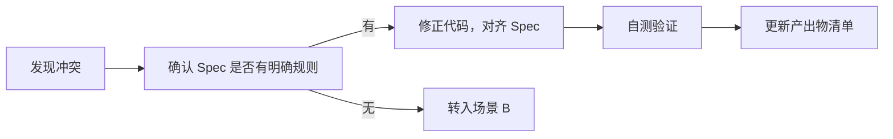
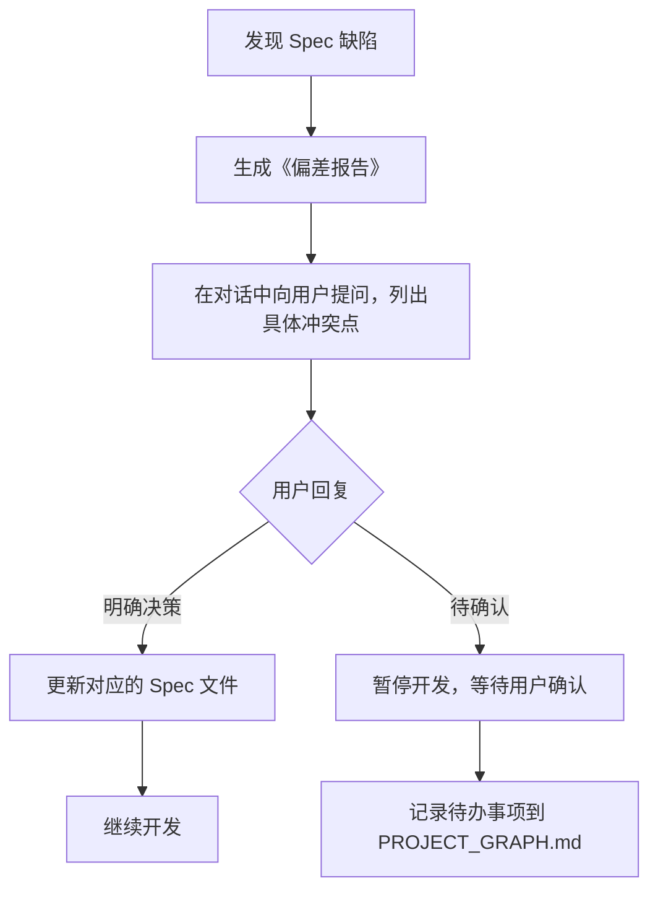
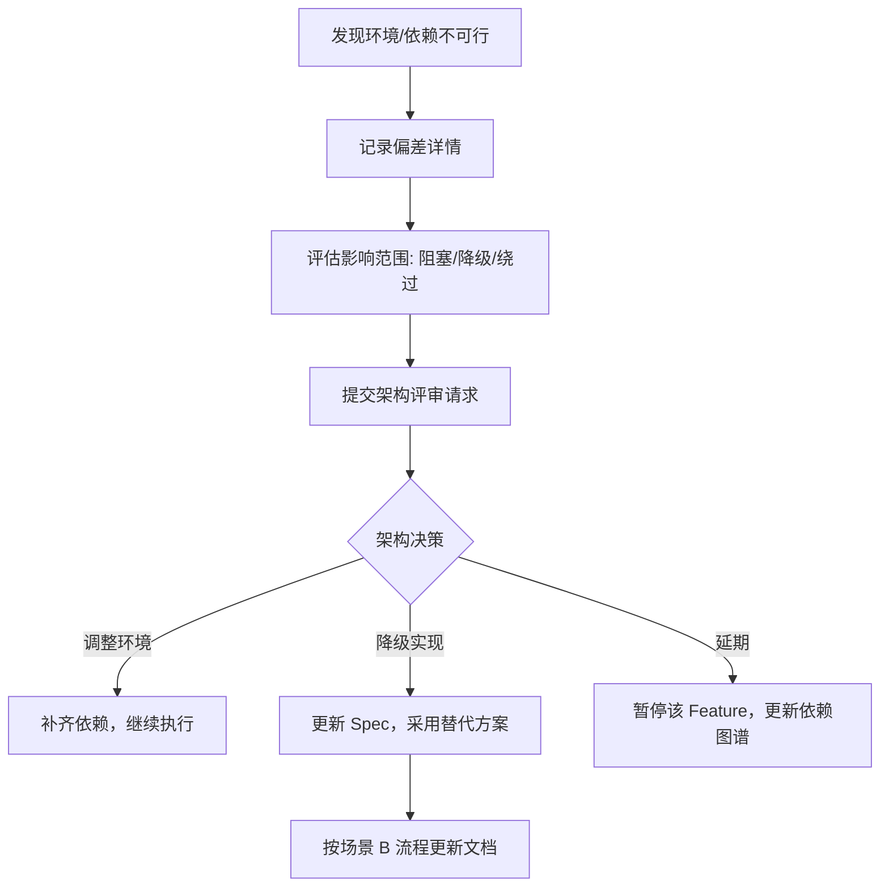

# 代码与 Spec 冲突裁决规则

> **文档定位**：当 AI 或开发者在编码过程中发现代码实现与 Spec（需求文档、契约文件、全局宪法）存在冲突时的**强制处理流程**。本规则优先于任何口头约定和临时决策。

---

## 一、核心原则（铁律）

### 原则 1：Spec 是唯一事实源（Single Source of Truth）
- 文档（`REQ.md`、`API_CONTRACT.yaml`、`CONSTITUTION.md`）与代码冲突时，**错的一定是代码**。
- **禁止**为了"让代码跑通"而绕过 Spec 的约束。

### 原则 2：先改文档，再改代码（Reverse Sync）
- 任何需求变更、接口调整、技术方案修正，**必须先更新对应的 Spec 文件**，再修改代码。
- 未经文档更新的代码修改，视为"技术债务"，必须在 24 小时内补录。

### 原则 3：裁决路径分级
- **L1 - 明确冲突**：Spec 有明确定义，代码违反 → **立即停止，修正代码**。
- **L2 - Spec 缺陷**：Spec 定义不清晰、缺失或自相矛盾 → **暂停开发，提交裁决请求**。
- **L3 - 环境/依赖冲突**：Spec 定义的技术方案在当前环境不可行 → **记录偏差，提交架构评审**。

---

## 二、冲突场景与裁决流程

### 场景 A：代码与 Spec 明确冲突（L1）

**典型表现**：
- 接口路径不符合 `API_CONTRACT.yaml` 定义。
- 异常错误码未使用 `CONSTITUTION.md` 规定的区间。
- 数据库表名、字段名违反命名规范。

**处理流程**：



**裁决结果**：**代码无条件修正**，不允许任何例外。

---

### 场景 B：Spec 存在缺陷（缺失/矛盾/模糊）（L2）

**典型表现**：
- `REQ.md` 中描述"密码至少 6 位"，但 `API_CONTRACT.yaml` 中 `password` 字段无 `minLength` 约束。
- `REQ.md` 要求"登录失败 5 次锁定"，但未说明锁定后如何解锁。
- 前端 `REQ.md` 要求"支持微信登录"，但后端 `REQ.md` 未提及该需求。

**处理流程**：



**裁决结果**：**必须等待人工裁决**，AI 不得自行"补全"或"脑补"缺失内容。

**偏差报告模板**（AI 自动生成）：
```markdown
## ⚠️ Spec 缺陷报告

| 缺陷类型 | 涉及文件 | 具体描述 | 建议方案 |
| :--- | :--- | :--- | :--- |
| 字段缺失 | API_CONTRACT.yaml | password 字段缺少 minLength 约束 | 建议增加 minLength: 6 |
| 需求冲突 | REQ.md vs BE/REQ.md | 前端要求微信登录，后端未实现 | 需确认是否纳入本期范围 |
| 定义模糊 | REQ.md | 账号锁定机制未说明解锁方式 | 建议明确：自动解锁 or 人工解锁 |
```

---

### 场景 C：环境/依赖导致 Spec 不可行（L3）

**典型表现**：
- Spec 要求使用 Redis，但当前环境无 Redis 实例。
- Spec 要求 Spring Boot 3.2，但项目实际是 2.7。
- Spec 要求调用的第三方 API 尚未就绪或已下线。

**处理流程**：



**裁决结果**：**必须升级决策**，AI 无权自行替换技术方案（如"Redis 不行就用内存缓存代替"）。

---

## 三、紧急情况特例（Hotfix）

**适用条件**：
- 线上系统出现 P0/P1 级故障。
- 需在 30 分钟内完成修复止血。

**处理流程**：

1. **允许跳过反向同步**：AI 或开发者可直接修改代码修复问题。
2. **强制补录**：修复完成后，必须在 `PROJECT_GRAPH.md` 的备注中标记 `⚠️ 紧急补丁，待反向同步`。
3. **24 小时内补录**：必须安排一次 `Sync-Feature` 任务，将紧急修改同步回对应的 Spec 文件，并追加变更履历。

---

## 四、裁决争议的升级路径

当 AI 无法判断冲突级别，或开发者与 AI 的裁决意见不一致时：

| 争议级别 | 裁决人 | 时限 |
| :--- | :--- | :--- |
| L1 明确冲突 | AI 自行修正，无需人工 | 即时 |
| L2 Spec 缺陷 | 产品经理/技术负责人 | 2 小时内 |
| L3 环境不可行 | 架构师/技术委员会 | 4 小时内 |
| 任何级别的开发者异议 | 团队评审会议 | 当日 |

---

## 五、AI 执行检查清单

在每次开发完成并签署"已交付"前，AI 必须自检以下项：

- [ ] 是否有任何代码行为与 `API_CONTRACT.yaml` 不一致？
- [ ] 是否有任何依赖或配置偏离 `CONSTITUTION.md`？
- [ ] 是否存在未在 `REQ.md` 中记录的业务逻辑？
- [ ] 是否所有变更都已更新到变更履历？

**若有任何一项为"是"，不得签署完成**，必须先执行反向同步流程。

---

## 六、版本与维护

| 版本 | 日期 | 变更说明 | 作者 |
| :--- | :--- | :--- | :--- |
| v1.0 | 2026-06-29 | 初始创建，基于反向同步原则 | AI-Assistant |
