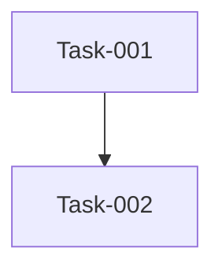

# 本期任务总览

> 迭代：Iteration-001-ecommerce-test
> 时间范围：未指定 ~ 未指定
> 迭代状态：🔄 进行中
> 负责人：张三
> 默认分支: 继承全局配置

## 任务列表

| 任务编号 | 任务名称 | 类型 | 进度 | 状态 | 负责人 |
| :--- | :--- | :--- | :--- | :--- | :--- |
| Task-026-fix-login-timeout | 修复登录超时 | bugfix | 0% | 🔲 待开发 | |
| Task-025-product-crud | 商品管理 | feature | 0% | 🔲 待开发 | |
| Task-024-user-auth | 用户认证 | feature | 0% | 🔲 待开发 | |
| Task-023-iter-4x45 | 重构数据库连接池 | refactor | 0% | 🔲 待开发 | |
| Task-022-iter-3fpi | 修复登录超时 | bugfix | 0% | 🔲 待开发 | |
| Task-021-iter-28xa | 商品管理 | feature | 0% | 🔲 待开发 | |
| Task-020-iter-2pqc | 用户认证 | feature | 0% | 🔲 待开发 | |
| Task-019-user-auth | User Auth | feature | 0% | 🔲 待开发 | |
| Task-018-refactor-db-layer | Refactor DB Layer | refactor | 0% | 🔲 待开发 | |
| Task-017-fix-login-bug | Fix Login Bug | bugfix | 0% | 🔲 待开发 | |
| Task-016-user-auth | User Auth | feature | 0% | 🔲 待开发 | |
| Task-015-user-auth | User Auth | feature | 0% | 🔲 待开发 | |
| Task-014-small-config | Small Config | feature | 0% | 🔲 待开发 | |
| Task-013-admin-dashboard | Admin Dashboard | feature | 0% | 🔲 待开发 | |
| Task-012-user-auth | User Auth | feature | 0% | 🔲 待开发 | |
| Task-011-admin-dashboard | Admin Dashboard | feature | 0% | 🔲 待开发 | |
| Task-010-user-auth | User Auth | feature | 0% | 🔲 待开发 | |
| Task-009-test-task | Test Task | feature | 0% | 🔲 待开发 | |
| Task-008-product-list | Product List | feature | 0% | 🔲 待开发 | |
| Task-007-user-auth | User Auth | feature | 0% | 🔲 待开发 | |
| | | | | | |

## 依赖图谱

## 状态看板

| 待开发 | 进行中 | 已完成 | 已归档 |
| :--- | :--- | :--- | :--- |
| | | | |
