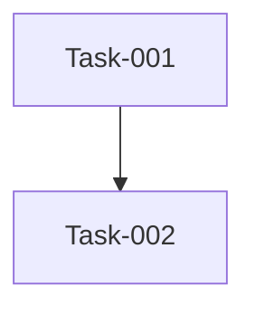

# 本期任务总览

> 迭代：Iteration-002-test-feature-module
> 时间范围：未指定 ~ 未指定
> 迭代状态：🔄 进行中
> 负责人：未指定

## Git 配置

> 以下配置覆盖全局 CONSTITUTION.md，任务级 .meta/git-config 又覆盖本处。
> 留空或填"继承全局配置"则使用上一级配置。

| 配置项 | 值 | 说明 |
| :--- | :--- | :--- |
| 默认分支 | 继承全局配置 | 主分支名（main/master） |
| 分支前缀 | | 如 2060708，追加到分支名中 |
| 分支格式 | 继承全局配置 | 模板：{type}/{prefix}{name}-{hash4} |
| 自动拉取 | 继承全局配置 | 创建分支前是否 git pull |
| 远程名称 | 继承全局配置 | 远程仓库名（origin） |

## 任务列表

| 任务编号 | 任务名称 | 类型 | 进度 | 状态 | 负责人 |
| :--- | :--- | :--- | :--- | :--- | :--- |
| Task-034-22 | 2.2 订单管理 | feature | 0% | 🔲 待开发 | |
| Task-033-21 | 2.1 用户管理 | feature | 0% | 🔲 待开发 | |
| Task-032-22 | 2.2 订单管理 | feature | 0% | 🔲 待开发 | |
| Task-031-21 | 2.1 用户管理 | feature | 0% | 🔲 待开发 | |
| | | | | | |

## 依赖图谱

## 状态看板

| 待开发 | 进行中 | 已完成 | 已归档 |
| :--- | :--- | :--- | :--- |
| | | | |
