# SpecCore — Code by Spec, Not by Vibe

🖥️ 规范驱动开发 CLI · 20 命令 · 人机协同闭环 · 多层 AI 架构

```bash
@spec-ask "分析会议预订系统的需求文档，拆分为独立开发任务，按依赖顺序执行"
```

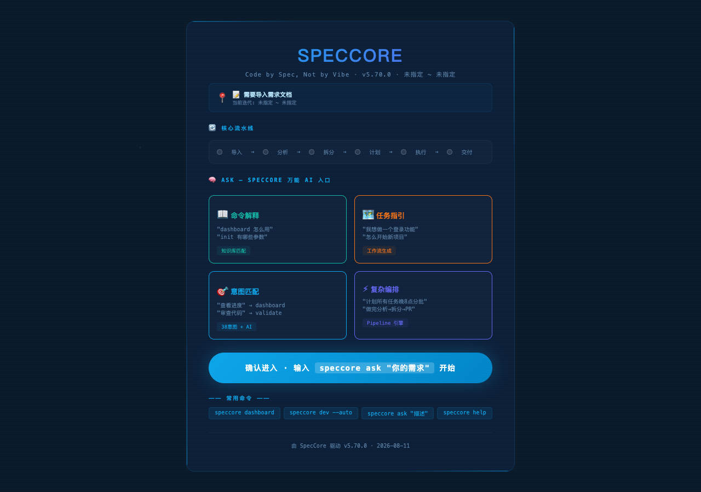

**🧠 万能 AI 入口** — 一个命令解决所有问题

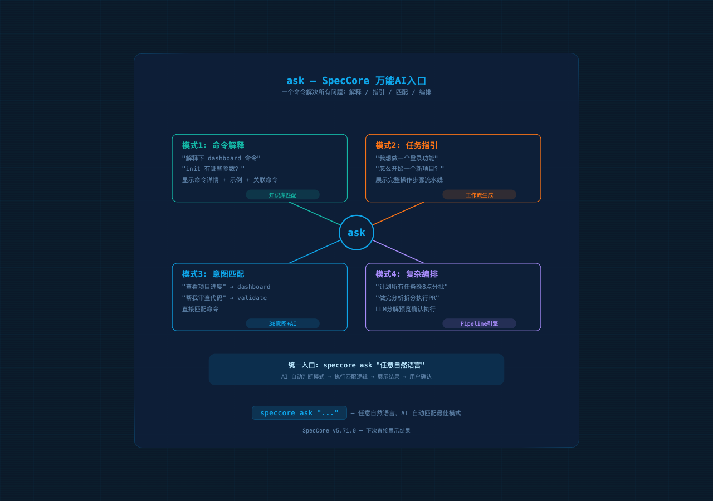

---

## 架构概览

```
@spec-ask "..."  ← AI 入口 →  @spec-ask "全自动执行"
    │                                     │
    ├─ 📖 命令解释 "dashboard 怎么用"      ├─ 🏗️ 初始化
    ├─ 🗺️ 任务指引 "我想做登录"           ├─ 📝 导入需求
    ├─ 🎯 意图匹配 "查看进度"              ├─ 🧠 AI 分析
    └─ ⚡ 复杂编排 "计划→定时→分批"        ├─ 📦 拆分任务
                                          ├─ ⚡ 执行开发
    ┌─────────────────────────────┐        ├─ 🔀 提交 PR
    │  speccore dashboard         │        ├─ ✅ 归档收尾
    │  ─ 全局仪表盘 (7 大维度)     │        └─ 📊 生成回顾
    │  ─ 9 主题 / 中英文 / 字号   │
    │  ─ F 键全屏 / 四边扫描线    │
    └─────────────────────────────┘
```

## 快速开始

```bash
npm install -g speccore
speccore init                                                    # 初始化项目（CLI）
speccore iteration create -n Q1 --topic meeting-system --owner luzhaosheng  # 创建迭代（CLI）
speccore task new -n "用户登录" --topic user-login -i meeting-system         # 创建任务（CLI）
speccore context --set --iteration Iteration-001-meeting-system              # 切换上下文（CLI）
speccore dashboard                                                             # 查看仪表盘（CLI）
```

**📋 配置引导页** — `speccore init` 后自动生成 6 步引导，帮助新用户快速上手：

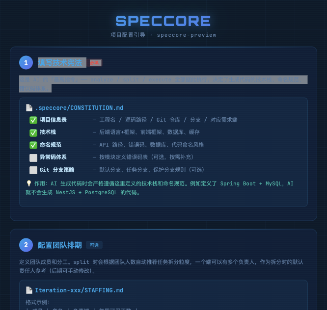

> 💡 **AI 命令**（在 WorkBuddy/Trae/Qcoder 中通过 `@spec-ask` 或 `/spec-ask` 使用）：分析需求、制定计划、执行开发。详见 [AGENTS.md](./AGENTS.md)。

## 核心流水线 🔒 AI 命令

```
init → doc2spec → analyze → split → plan → execute → pr → done → spec2doc
                   └─ .issues.md ← 问题发现 ── → AI 辅助修复
                   └─ .needs-retry ← 失败标记 ── → execute --resume
```

## 命令列表

| 分类 | 命令 |
|------|------|
| CLI 入口 | `init` `welcome` `help` |
| CLI 管理 | `iteration` `task` `context` ✅ |
| CLI 查看 | `dashboard` `validate` `about` `config` `archive` |
| 🔒 AI 入口 | `ask` |
| 🔒 AI 流水线 | `doc2spec` `analyze` `split` `plan` `execute` `pr` `done` `spec2doc` |
| 🔒 AI 智能 | `dev` |
| 🔒 AI 变更 | `change` `retro` |

## 目录结构（全英文）

```
Iteration-001-meeting/
├── 000-overview/               ← 进度跟踪
├── 010-requirements/           ← 需求文档（按功能组织）
│   ├── README.md               ← 目录规范说明
│   ├── INDEX.md                ← 需求文档索引
│   ├── sources/                ← [只读] 原始 PRD/Word/PDF
│   ├── converted/              ← [自动生成] doc2spec 转换后的 MD
│   ├── features/               ← [手动维护] 按功能模块组织
│   │   └── {feature}/README.md
│   ├── prototypes/             ← 原型（HTML/图片/链接）
│   └── assets/                 ← 素材（extracted/）
├── 020-specs/                  ← analyze 分端输出
│   ├── global/                 ← 跨端文档（REQUIREMENT/ANALYSIS/RISK/DEPS/REVIEW/MONITOR）
│   └── {platform}/             ← 各端专属（TECH/TEST/UI_SPEC）
├── 030-tasks/                  ← split 开发任务
│   └── Task-001-*/
│       ├── .meta/              ← 任务元信息（type/status/owner/feature/created-at）
│       ├── _shared/            ← 共享契约（API_CONTRACT.yaml）
│       ├── 00-specs/           ← 执行前核心规格（REQ/TECH/TASK/SCHEMA/CHANGELOG）
│       ├── {platform}/         ← 各端实现（平铺，如 booking-service/ h5-mobile/ admin-web/）
│       └── .issues.md          ← 问题追踪
└── STAFFING.md                 ← 人员排期
```

## 断点重试 🔒 AI 命令

```bash
# 在 AI IDE 中通过 @spec-ask 使用：
@spec-ask "全量执行"           # 全量执行
# 部分任务失败 → 写入 .issues.md + .needs-retry
@spec-ask "断点续传"           # 扫描 .needs-retry 续跑
```

## 批量回顾 🔒 AI 命令

```bash
# 在 AI IDE 中通过 @spec-ask 使用：
@spec-ask "生成所有任务的回顾"
@spec-ask "生成张三的所有任务回顾"
@spec-ask "生成所有 bugfix 类型任务的回顾"
```

### 🧠 AI 语义入口

在 AI IDE 中使用 `@spec-ask` 或 `/spec-ask`，无需记忆命令：

**📖 命令解释** — `@spec-ask "dashboard 怎么用"`

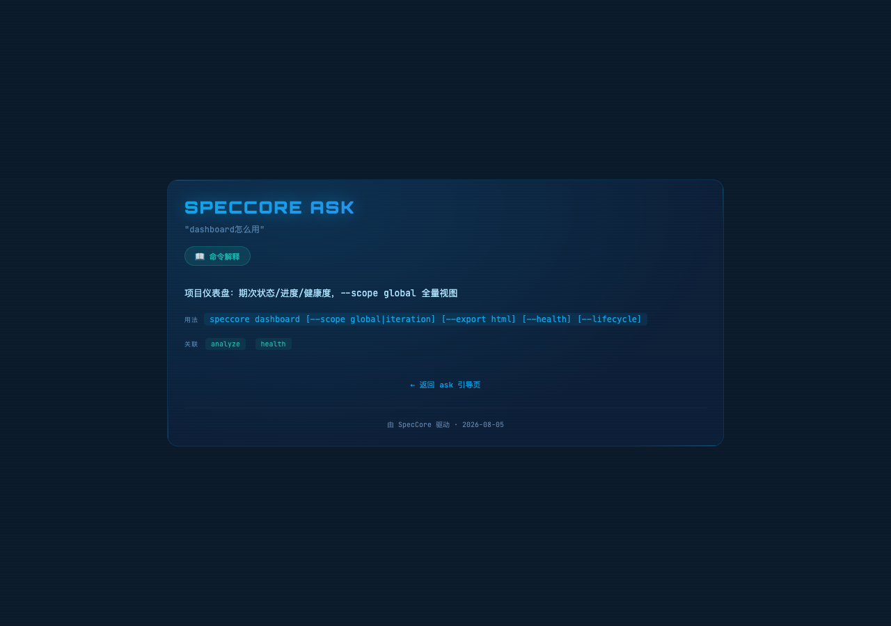

**🎯 意图匹配** — `@spec-ask "查看进度"` → AI 自动匹配 dashboard

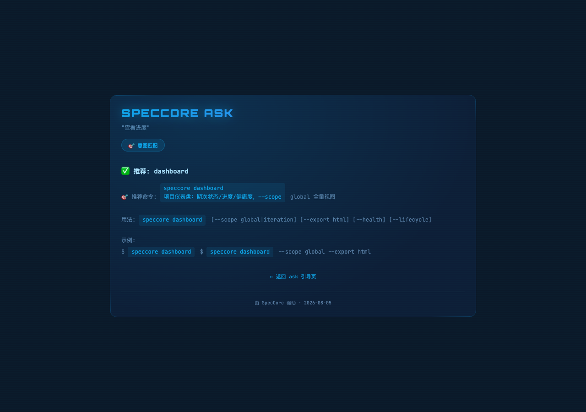

**🗺️ 任务指引** — `@spec-ask "我想做一个支付功能"` → AI 自动编排全流程

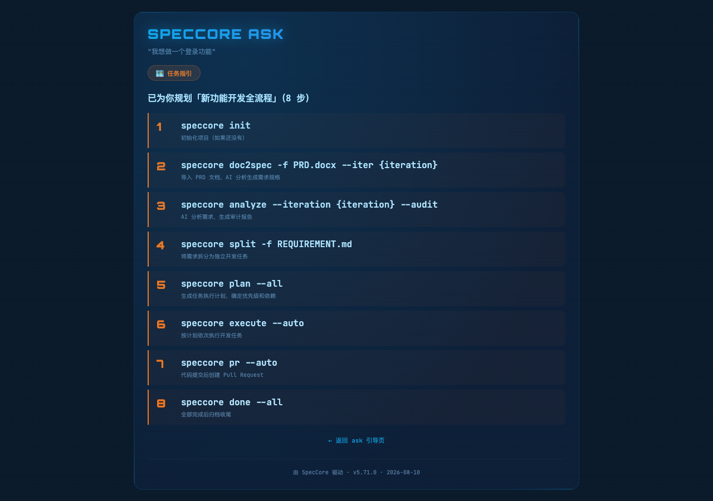

**⚡ 复杂编排** — `@spec-ask "分析+计划自动，执行前确认"` → analyze→plan 连续跑

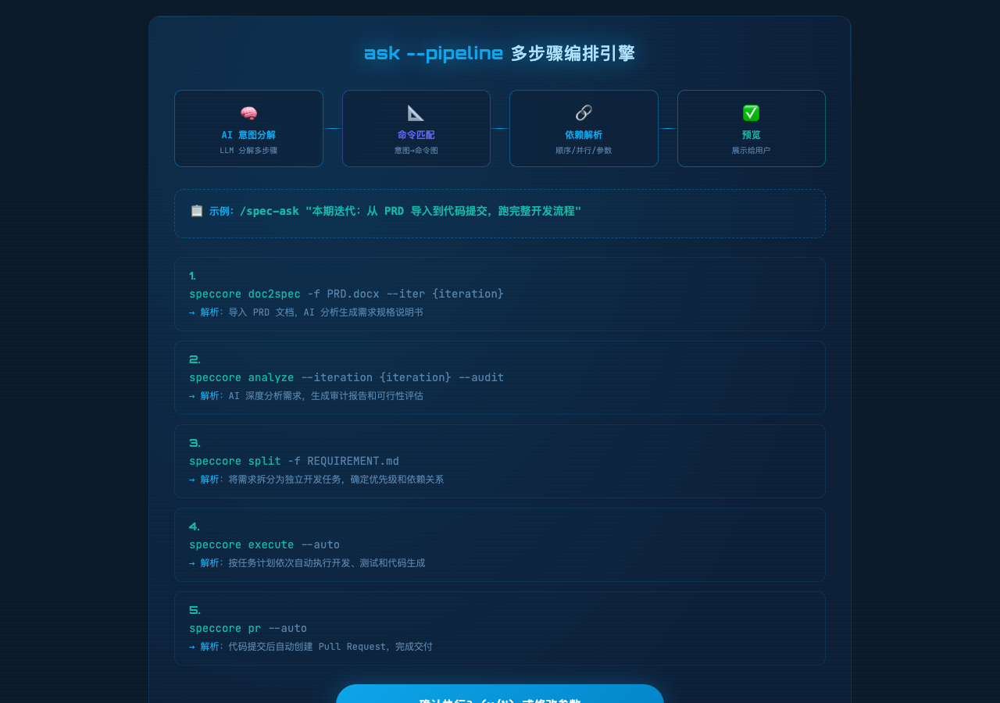

### 🧠 knowledge — 知识图谱可视化与代码图谱查询
`speccore knowledge` 生成交互式 HTML 知识图谱：
- vis-network 力导向图：9 种形状区分实体类型（需求◆ 规格🛢 功能模块■ 任务▲ 全局★ 业务模块⭐ 源码）
- 业务-代码关联图谱：从 TECH.md 提取业务模块→代码实体映射，支持开放关系类型
- 衰减检测：自动发现内容变更、下游过期、文件丢失、代码超前等风险
- RAG 上下文预览：查看 AI 检索时会注入的完整上下文
- 9 套主题 / 3 种字体 / 4 档字号 / 全屏模式 / 实体搜索 / 类型过滤

**v6.90.0+ 代码知识图谱** — 本地 AST 解析，零 LLM Token：
```bash
speccore code-index --graph --scope src           # 构建代码知识图谱
speccore knowledge-explain "buildCodeGraph"       # 解释节点及其连接
speccore knowledge-path "AuthModule" "UserDB"     # 查找最短依赖路径
speccore knowledge-query "how does payment work"  # 自然语言查询
```
- 基于 TypeScript 编译器 API 本地解析（代码不出本机）
- 自动生成 `graph.json` + `GRAPH_REPORT.md` + `graph.html`
- 社区检测自动划分子系统，识别 God nodes 和跨社区桥梁
- v6.91.0+ 支持 API Contract / SQL Schema 多模态纳入图谱

**v7.0.0+ 统一图谱查询** — 融合知识图谱 + 代码图谱：
```bash
speccore graph query "订单相关代码"              # 自然语言统一查询（默认 LLM 语义增强）
speccore graph query "订单相关代码" --fast        # 快速模式（零 Token）
speccore graph entity SRC:auth-AuthController      # 查询实体详情（含语义标签）
speccore graph related Task-001                    # 查询关联实体
speccore graph path Task-001 Task-002              # 查找最短路径
speccore graph stats                               # 统计信息（含语义标签覆盖率）
```
- 语义标签匹配：查询 "订单" 也能匹配到 `booking`、`purchase`、`交易` 相关代码
- LLM 语义排序：综合得分 = 本地匹配 × 0.4 + LLM 语义 × 0.6
- 查询结果融合：同时搜索知识图谱（需求/任务）和代码图谱（类/方法）

**v7.1.0+ Mermaid 图表渲染** — 将分析产物可视化：
```bash
speccore graph render diagrams/architecture.mmd    # 渲染单个图表
speccore graph render --all                         # 批量渲染所有 .mmd
speccore graph render --extract ARCHITECTURE.md     # 从 Markdown 提取图表
```
- 全局分析自动在文档中嵌入 Mermaid 图表（模块关系图、时序图、流程图、状态图）
- 独立 `.mmd` 文件输出到 `.speccore/GLOBAL/diagrams/`
- 生成响应式 HTML 页面，支持打印和主题切换

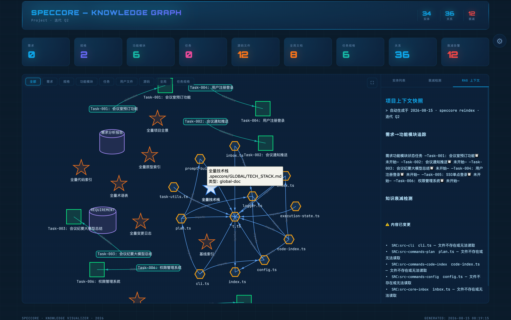

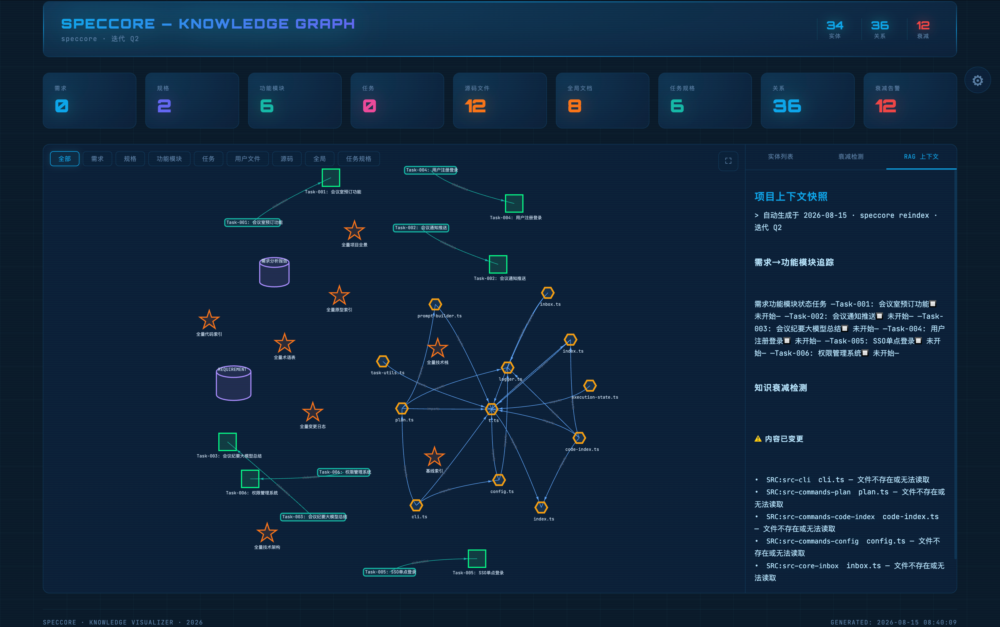

### 📊 dashboard — 全局仪表盘
`speccore dashboard --scope global` 生成 Jira 标准 7 维度 HTML 看板：
- 需求状态分布（饼图）+ 项目需求分布（柱状图）+ Created vs Resolved
- 项目健康度评分 + 期次进度条 + 需求详情表（按期次倒序）
- 9 套主题、中英文切换、字体/字号调节、F 键全屏、四边脉冲扫描线

**全局项目看板**

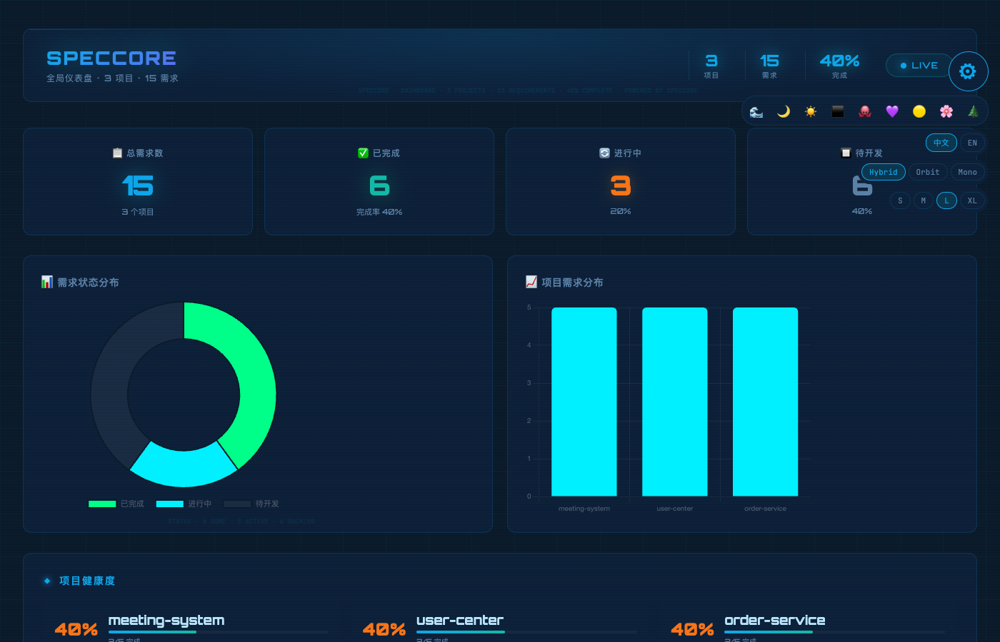

**迭代看板**（`speccore dashboard --export html`）
- 迭代时间线 + 里程碑 + Gantt 图 + Burndown 图
- 任务分布 + 完成率 + 团队分工 + 个人进度

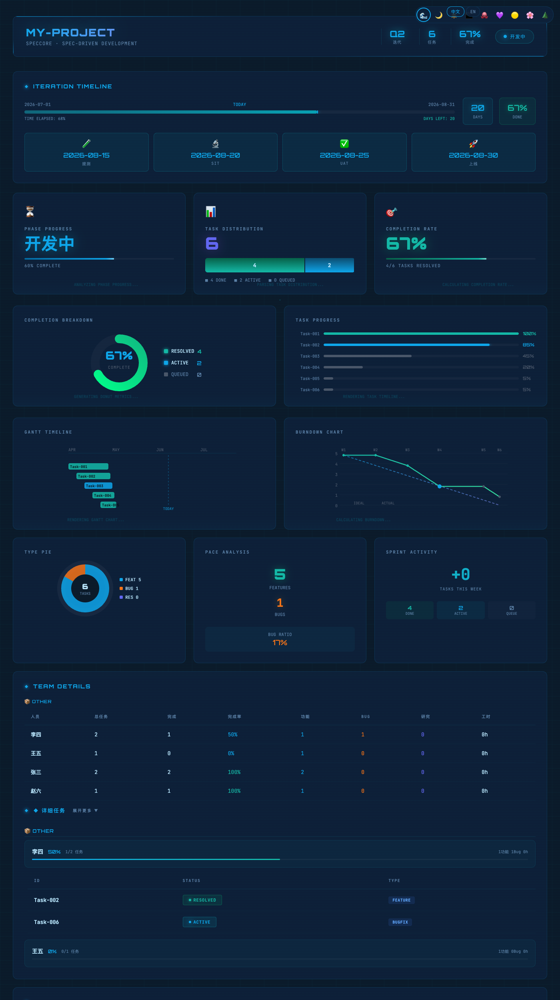

### 🔄 dev — 智能级联
在 AI IDE 中智能推进：`@spec-ask "全自动执行"`

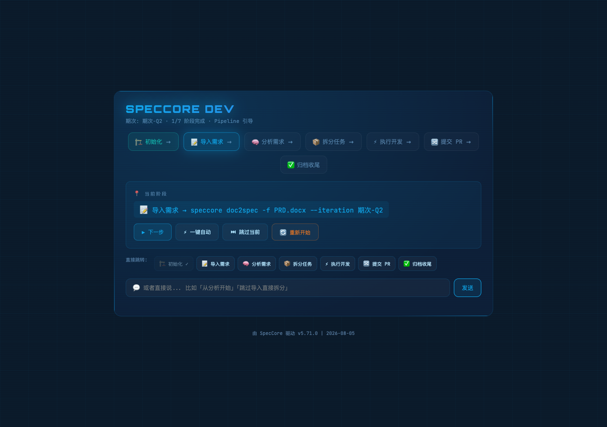

### 🚀 全量流水线 🔒 AI 命令（在 IDE 中使用）
| 阶段 | 命令 | AI 模式 |
|------|------|------|
| 导入需求 | `doc2spec -f PRD.docx` | 📖 命令解释 |
| AI 分析 | `analyze --audit` | 🗺️ 任务指引 |
| 拆分任务 | `split` | 🎯 意图匹配 |
| 执行计划 | `plan --all` | ⚡ 复杂编排 |
| 开发执行 | `execute --batch-size 3` | ⚡ 复杂编排 |
| 提交 PR | `pr --auto` | 🎯 意图匹配 |
| 归档收尾 | `done --all` | 🎯 意图匹配 |

## 安装 & 环境

```bash
npm install -g speccore
speccore --version   # v7.1.0
```

## 命令列表

| 命令 | 别名 | 功能 |
|------|------|------|
| `ask` | — | 🧠 🔒 万能 AI 入口（4 模式） |
| `welcome` | — | 🏷️ 项目名片 + 使用引导 |
| `dashboard` | `db` | 📊 期次/全局仪表盘 |
| `dev` | `d` | 🔄 🔒 智能级联流水线 |
| `init` | `in` | 🏗️ 项目初始化 |
| `doc2spec` | `d2s` | 📝 🔒 PRD→SpecCore MD |
| `spec2doc` | `s2d` | 📤 🔒 SpecCore MD→Word/PDF/HTML |
| `analyze` | `al` | 🧠 🔒 AI 需求分析 |
| `split` | — | 📦 🔒 需求拆分 |
| `plan` | `pl` | 📐 🔒 执行计划 |
| `execute` | `ex` | ⚡ 🔒 执行开发 |
| `pr` | `mr` | 🔀 🔒 Pull Request |
| `done` | `dn` | ✅ 🔒 归档收尾 |
| `change` | `ch` | 🔄 🔒 需求变更 |
| `sync` | `sy` | 🔄 🔒 双向同步 |
| `validate` | `vl` | ✅ 合规验证 |
| `graph` | `g` | 🕸️ 统一图谱查询（知识+代码）+ Mermaid 渲染 |
| `knowledge` | `kg` |  🌐 知识图谱可视化 + 衰减检测 + 代码图谱查询 |
| `track` | `trk` | 🔗 🔒 REQ→Task→Code 全链路 |
| `search` | `sh` | 🔍 跨 Spec 全文搜索 |
| `retro` | `rt` | 📝 🔒 任务回顾复盘 + 评分 |
| `rename` | `rn` | ✏️ 🔒 重命名 |
| `ops` | `op` | 📜 操作历史 |

## TTY 智能适配

所有 AI 命令 (`ask`, `welcome`, `dev`, `dashboard`, `help`) 自动检测环境：
- **终端**：Unicode 框线美化输出
- **AI 调用**：自动生成 Ocean 主题 HTML 页面（四边脉冲扫描线）

## 🤖 三层 AI 架构

```
@spec-ask "..."  (AI IDE 入口)
  ├─ 🧠 自有 LLM   → OpenAI / Ollama（SPECCORE_LLM_KEY 环境变量）
  ├─ 🤖 宿主 AI    → WorkBuddy / TRAE / Qoder（自动检测）
  └─ 📐 规则引擎   → 18 条命令 KB + 4 预定义工作流（永远可用）
```

零配置：没配 Key 自动降级，功能不受影响。

## 📖 文档

| 中文 | English | 说明 |
|------|---------|------|
| [快速开始](docs/quick-start.md) | [Quick Start](docs/quick-start.en.md) | 5 分钟上手，安装 → 完整流程 |
| [命令参考](docs/command-reference.md) | [Commands](docs/commands.en.md) | 全部 20 命令 + 子命令 + 示例 |
| [总览](docs/overview.md) | — | 核心概念 + 工作流 + 三种使用方式 |
| [场景实战](docs/scenarios.md) | [Scenarios](docs/scenarios.en.md) | 35 个真实开发场景 |
| [SDD 方法论](docs/sdd-methodology.md) | [SDD](docs/sdd-methodology.en.md) | 规范驱动开发理念 |
| [工作空间组织](docs/workspace-organization.md) | [Workspace](docs/workspace-organization.en.md) | 目录结构与文件规范 |
| [工具适配说明](docs/tool-adapters.md) | [Adapters](docs/tool-adaptation.en.md) | Qoder/TRAE 等 AI 工具集成 |
| [三层加载机制](docs/spec-layers.md) | — | GLOBAL/ITERATION/TASK 加载原理 |
| [CI-CD 集成](docs/ci-cd-spec-integration.md) | — | CI/CD 流水线 + Spec 注释 |
| [迁移指南](docs/migration-guide.md) | [Migration](docs/migration-guide.en.md) | 从旧版本升级 |
| [CHANGELOG](CHANGELOG.md) | [CHANGELOG](CHANGELOG.en.md) | 版本历史 |

## 许可

MIT © 2026 SpecCore Team
