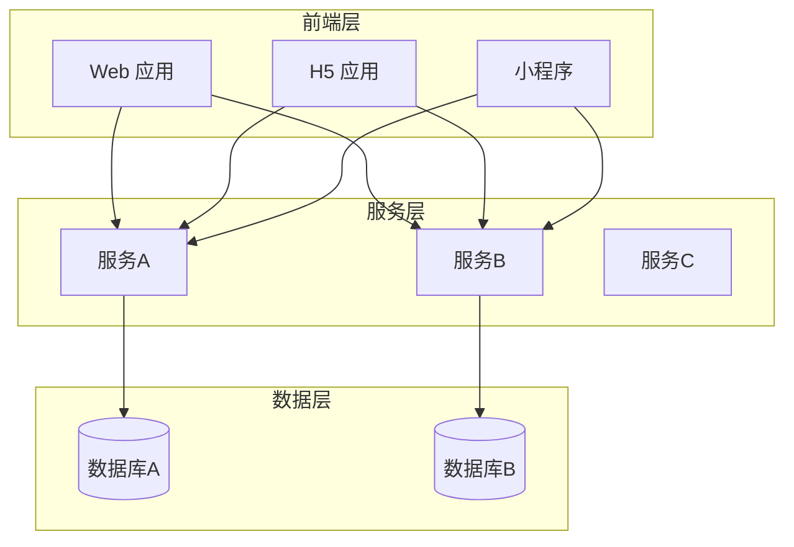

# 全量技术架构

> 本文档描述所有项目的整体技术架构，是跨项目、跨系统的全量视图。

## 系统架构图

## 服务列表

| 服务名称 | 类型 | 技术栈 | 端口 | 描述 |
| :--- | :--- | :--- | :--- | :--- |
| _待导入_ | - | - | - | - |

## 服务间调用关系

| 调用方 | 被调用方 | 通信方式 | 说明 |
| :--- | :--- | :--- | :--- |
| _待导入_ | - | - | - |

## 跨服务数据模型

| 模型名称 | 所属服务 | 被依赖服务 | 说明 |
| :--- | :--- | :--- | :--- |
| _待导入_ | - | - | - |

## 外部依赖

| 依赖名称 | 用途 | 版本 | 说明 |
| :--- | :--- | :--- | :--- |
| _待导入_ | - | - | - |
