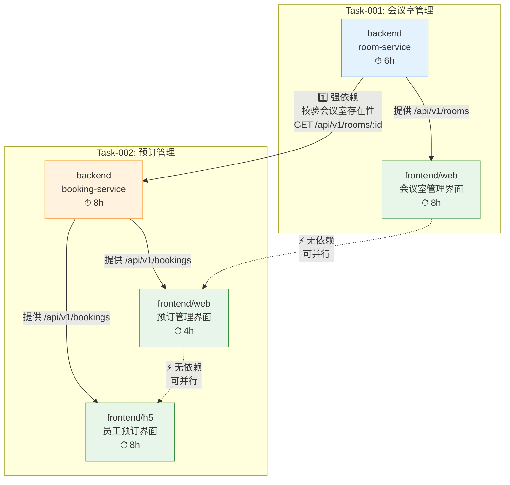

# Q1 任务计划 & 关联关系

> 期次: Q1 | 总 Task: 2 | 总 AC: 18 | 总预估工时: 34h

---

## 一、任务关联图



**依赖说明**:
- 🔴 **强依赖**: Task-002/booking-service → Task-001/room-service（预订时需校验会议室是否存在）
- 🟢 **并行**: Task-001 后端完成后，前端 web + booking-service 可同时开工
- 🟢 **并行**: Task-002 的 web 和 h5 共享 API，互不阻塞

---

## 二、任务关联矩阵

| 从 | 到 | 关系 | 说明 |
| :--- | :--- | :--- | :--- |
| Task-001/backend/room-service | Task-002/backend/booking-service | **强依赖** | 预订时需校验会议室存在，调用 `GET /api/v1/rooms/{id}` |
| Task-001/backend/room-service | Task-001/frontend/web | **强依赖** | Web 管理端依赖会议室列表/详情 API |
| Task-002/backend/booking-service | Task-002/frontend/web | **强依赖** | Web 预订管理依赖预订 API |
| Task-002/backend/booking-service | Task-002/frontend/h5 | **强依赖** | H5 端依赖预订 + 冲突检测 API |
| Task-001/frontend/web | Task-002/frontend/web | **无依赖** | 独立页面，可并行 |
| Task-001/frontend/web | Task-002/frontend/h5 | **无依赖** | 独立页面，可并行 |
| Task-002/frontend/web | Task-002/frontend/h5 | **无依赖** | 共享 API，可并行开发 |

---

## 三、执行计划（推荐顺序）

```
Day 1 ────────────────────────────────────────────────────
  ☐ Task-001 backend/room-service  (6h)
     ├── Flyway V1 建表
     ├── Room Entity + DTOs
     ├── RoomController (5 API)
     ├── RoomService + 业务逻辑
     └── 单元测试 (14 用例)

Day 2 ────────────────────────────────────────────────────
  ☐ Task-001 frontend/web  (8h)      │  ☐ Task-002 backend/booking-service (前 4h)
     ├── 会议室列表页                  │     ├── Flyway V2 建表
     ├── 新增/编辑弹窗                 │     ├── Booking Entity + DTOs
     ├── room api 封装                │     └── BookingController 骨架
     └── 删除确认交互                  │
                                      │
Day 3 ────────────────────────────────────────────────────
                                      │  ☐ Task-002 backend/booking-service (后 4h)
                                      │     ├── 冲突检测逻辑 (核心难点)
                                      │     ├── check-conflict 预检接口
                                      │     └── 并发测试 (4 场景)
                                      │
                                      │  ☐ Task-002 frontend/h5 (前 4h)
                                      │     ├── 会议室列表页 + 日期选择
                                      │     └── Vant 组件调试
                                      │
Day 4 ────────────────────────────────────────────────────
  ☐ Task-002 frontend/web  (4h)       │  ☐ Task-002 frontend/h5 (后 4h)
     ├── 预订管理列表页                │     ├── 预订确认页 + 实时冲突检测
     ├── booking api 封装             │     ├── 我的预订页 + 左滑取消
     └── 取消交互                      │     └── 微信兼容测试
```

---

## 四、里程碑

| 里程碑 | 截止 | 条件 | 产出 |
| :--- | :--- | :--- | :--- |
| M1: 会议室后端完成 | Day 1 | Task-001 backend AC 1-5 全部通过 | room-service 可独立部署 |
| M2: 管理端可演示 | Day 2 | Task-001 全部 AC 通过 | 会议室 CRUD 完整流程可走通 |
| M3: 预订后端完成 | Day 3 | Task-002 backend AC 1-5 通过 | booking-service 可独立部署 |
| M4: Q1 全部完成 | Day 4 | 所有 18 个 AC 通过 | 会议室管理 + 预订管理 完整可用 |

---

## 五、风险 & 缓解

| 风险 | 影响 Task | 概率 | 缓解措施 |
| :--- | :--- | :--- | :--- |
| 预订冲突检测并发脏写 | Task-002 backend | 中 | 数据库 `uk_booking_unique` 联合唯一索引兜底 |
| 微信浏览器兼容问题 | Task-002 h5 | 中 | 提前在微信环境验证 fixed → absolute |
| room-service 接口变更 | Task-002 backend | 低 | API_CONTRACT.yaml 已锚定，前后端按契约开发 |
| 时段冲突检测逻辑复杂度 | Task-002 backend | 低 | 4 场景单元测试全覆盖 |
