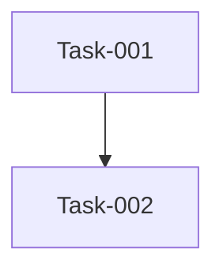

# 本期任务总览

> 期次：Q3
> 时间范围：2026-07 ~ 2026-09
> 期次状态：🔄 进行中

## 任务列表

| 任务编号 | 任务名称 | 类型 | 进度 | 状态 | 负责人 |
| :--- | :--- | :--- | :--- | :--- | :--- |
| Task-013 | 5. 附录 | feature | 0% | 🔲 待开发 | |
| Task-012 | 4. 验收标准 | feature | 0% | 🔲 待开发 | |
| Task-011 | 3.3 兼容性 | feature | 0% | 🔲 待开发 | |
| Task-010 | 3.2 安全 | feature | 0% | 🔲 待开发 | |
| Task-009 | 3.1 性能 | feature | 0% | 🔲 待开发 | |
| Task-008 | 3. 非功能需求 | feature | 0% | 🔲 待开发 | |
| Task-007 | 2.2 功能模块二 | feature | 0% | 🔲 待开发 | |
| Task-006 | 2.1 功能模块一 | feature | 0% | 🔲 待开发 | |
| Task-005 | 2. 功能需求 | feature | 0% | 🔲 待开发 | |
| Task-004 | 1.3 范围 | feature | 0% | 🔲 待开发 | |
| Task-003 | 1.2 目标 | feature | 0% | 🔲 待开发 | |
| | | | | | |

## 依赖图谱

## 状态看板

| 待开发 | 进行中 | 已完成 | 已归档 |
| :--- | :--- | :--- | :--- |
| | | | |
