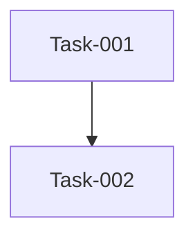

# 本期任务总览

> 期次：Q3
> 时间范围：2026-07-14 ~ 未指定
> 期次状态：🔄 进行中

## 任务列表

| 任务编号 | 任务名称 | 类型 | 进度 | 状态 | 负责人 |
| :--- | :--- | :--- | :--- | :--- | :--- |
| | | | | | |

## 依赖图谱

## 状态看板

| 待开发 | 进行中 | 已完成 | 已归档 |
| :--- | :--- | :--- | :--- |
| | | | |
