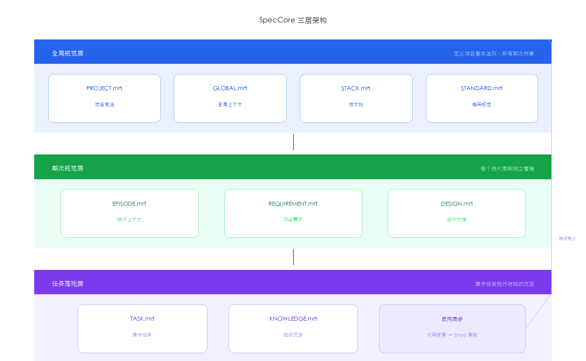
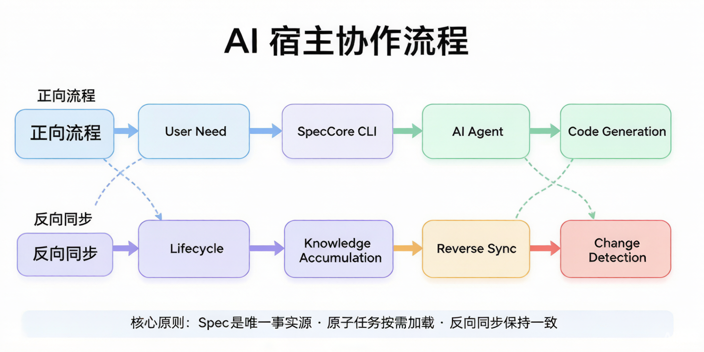
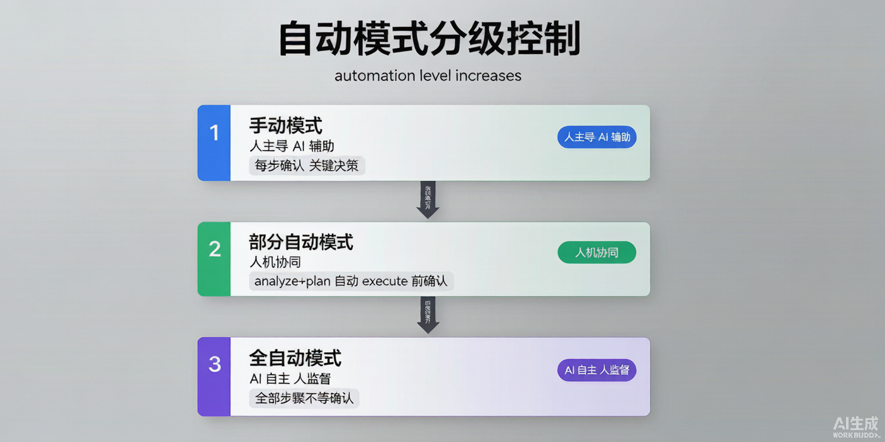

# 从 Vibe Coding 到 Spec Coding：SDD 重塑 AI 研发流程

> 当 AI 编程从个人玩具走向团队协作，从一次性脚本走向持续交付，我们需要的不只是一个更强的模型，而是一套完整的工程纪律。

---

## 一、Vibe Coding 的甜蜜与痛苦

2025 年初，Andrej Karpathy 提出了一个概念——**Vibe Coding**。不用写设计文档，不用画架构图，不用定义接口。对着 AI 说一句"帮我写一个会议室管理系统"，一个下午就能跑起来一个包含登录、CRUD、权限的完整后台。

听起来很美。直到三个月后：

| Vibe Coding 的隐患 | 我们需要的 |
|:---|:---|
| 代码风格混乱，新人读不懂 | 统一的代码风格规范 |
| 边界条件全部遗漏 | 完整的边界条件覆盖 |
| 架构随每次对话漂移 | 稳定的架构约束 |
| 新增需求时 AI 完全不理解历史逻辑 | AI 每次拿到精确的上下文 |
| 需求变更影响不可追踪 | 需求变更可以精确追溯 |
| 团队协作上下文断裂 | 知识可以跨项目复用 |

这就是我们说的**90 天墙**（90-Day Wall）：Vibe Coding 的产出三个月后，代码库进入不可维护状态。不是 AI 不够强——问题在于**信息没有结构化**。


---

## 二、SDD：从"感觉驱动"到"规范驱动"

### Spec-Driven Development 的起源

SDD（Specification-Driven Development）并不是新概念。早在 1990 年代，形式化方法（Formal Methods）就在航空航天、金融交易等安全关键领域使用。Z 语言、VDM、B 方法等形式化规约工具曾被用于验证伦敦地铁信号系统和巴黎地铁 14 号线的安全属性。但传统 SDD 的代价太高——写一份完整的形式化 Spec 往往比写代码本身还耗时，这导致它在商业软件开发中始终未成为主流。

**AI 改变了这个等式。**当 AI 可以在 5 分钟内从需求文档生成一份结构化的 Spec，SDD 不再是成本负担，而是效率杠杆。这一转变的本质是：将"人写 Spec → 人写代码"的两段式流程，重构为**"人确认 Spec → AI 写代码 → 人审核"的三段式人机协作**。

### 从 Vibe Coding 到 Spec Coding 的必然性

Vibe Coding 的核心问题是**"信息熵增"**。每次与 AI 对话都从零开始：没有文档，没有规范，没有历史约束。代码的增长速度远超理解力的增长速度，三个月后，没人能说清任何一行代码"为什么"在那里。

而 Spec Coding 的本质是**把 AI 的高效从一次性对话延展到整个软件生命周期**。它要解决的根本问题不是"AI 能不能写出代码"，而是**"三个月后，AI 还记不记得这段代码是干什么的"**。

### SDD 与主流开发方法论的定位

| 方法论 | 关注点 | 主要产出 | SDD 与之关系 |
|:---|:---|:---|:---|
| TDD | 测试先行，红-绿-重构 | 测试用例 | SDD 在 TDD 之前，先定义"测什么" |
| BDD | 行为驱动，Given-When-Then | 验收场景 | SDD 的 Spec 可直接映射为 BDD 场景 |
| DDD | 领域模型，限界上下文 | 领域模型图 | SDD 的 Spec 保存领域决策，DDD 则建模 |
| **SDD** | **规范驱动，Spec 为真** | **结构化 Spec 文档** | **TDD/BDD/DDD 的上游输入源** |

SDD 不是要替代 TDD、BDD 或 DDD，而是要为它们提供**唯一且精确的输入**。在一个 SDD 项目中，Spec 定义了"做什么"，TDD 保证"做对了"，BDD 验证"做得对"，DDD 建模"怎么做"。

### 三条铁律的深层含义

| 铁律 | 含义 |
|:---|:---|
| **No Spec, No Code** | 没有规范文档，不准 AI 写一行代码。Spec 是代码的准生证。目的不是增加流程，而是确保每个决策都有据可查 |
| **Spec is Truth** | 文档与代码不一致时，错的一定是代码。Spec 是唯一事实源。来自 NASA JPL 编码标准——代码可以重构，但规范必须稳定 |
| **Reverse Sync** | 发现 Bug 或需求变更时，先修文档，再修代码。支持 30 分钟紧急 Hotfix 跳过，但 24 小时内强制补录，知识永不丢失 |

### AI-SDD 的三层意义

| 层次 | 传统开发 | Vibe Coding | AI-SDD |
|:---|:---|:---|:---|
| **知识管理** | 文档与代码分离，逐渐过时 | 无文档，知识随对话消失 | **Spec 即知识**，文档与代码同仓版本化，变更履历完整可追溯 |
| **上下文管理** | 靠人脑记忆项目全貌 | AI 窗口爆满，断片重来 | **原子任务**，2K-5K tokens 精确加载，按需注入规范 |
| **变更管理** | 口头沟通，事后补文档 | 直接改代码，因果断裂 | **反向同步**，先改 Spec 再改代码，L1/L2/L3 三级冲突裁决 |

> SDD 不是让开发变慢，而是让 90 天后的你感谢现在写下 Spec 的自己。

---

## 三、SpecCore：AI-SDD 的工程实现

[SpecCore](https://github.com/windfallsheng/SpecCore-ts) 是一套开源的 AI-SDD 工具链。它不替代 WorkBuddy / Trae / Qcoder 等 AI IDE，而是在**这些宿主 AI 之上**提供一套规范化的研发流程。

核心理念九个字：**宪法进规则，流程进技能，数据放项目。**



### 三层分治架构

| 层级 | 内容 | 职责 | 关键文件 |
|:---|:---|:---|:---|
| GLOBAL | 全局宪法层 | 技术栈、命名规范、API 风格、异常码体系 | CONSTITUTION.md · INDEX.md · PATTERNS/ |
| ITERATION | 期次规范层 | 需求、分析、计划、拆分——每次迭代的完整过程 | 010-requirements/ · 020-specs/ · 030-tasks/ |
| TASK | 任务落地层 | 原子任务：REQ + TECH + TASK 自包含，2K-5K tokens | REQ.md · TECH.md · TASK.md |

### 六个核心优势

1. **分层清晰** — GLOBAL/ITERATION/TASK 三层职责不交叉，每层只管自己该管的事
2. **原子任务** — 每个 Task 自包含所有上下文，AI 不用加载整个项目就能精准完成任务
3. **反向同步** — L1/L2/L3 三级冲突裁决，代码与文档永不同步，支持紧急 Hotfix
4. **模式沉淀** — 每个 Feature 完成后自动提取可复用模式，下次 AI 主动检索复用
5. **多端统一** — 后台/H5/小程序共用一个需求文档，多端联动不改多份
6. **Git 原生** — 纯 Markdown + YAML 驱动，零运行时依赖，任意 Git 平台可用

---

## 四、一切走 ask：AI 与宿主的智能协作

SpecCore 的核心设计哲学是：**不要让用户记命令，让 AI 自己拼命令。**



**工作流程：**

1. 用户在 IDE 中说"分析 Q1 的任务001，然后制定计划"
2. `speccore ask` 输出知识库（KB）：所有可用命令和模板
3. 宿主 AI 读 KB，理解意图，拼出两条命令
4. **展示计划给用户确认**（非自动模式每步必确认）
5. 调用 `execute_command` 逐步执行

对于复杂意图，AI 还会自动拆分为多步骤管道：`analyze → plan → split → execute`，并在关键节点暂停，等待用户确认。

关键的改变是：**AI 不再"猜"用户要什么，而是拿到精确的 Spec 后去执行。**

---

## 五、自动模式分级：精确控制自动化范围

SpecCore 的自动模式不是全有或全无。实际工作中，很多时候我们希望前几步自动跑，到了关键决策节点再停下来确认。



| 模式 | 触发词示例 | 行为 |
|:---|:---|:---|
| 手动 | 默认（不说自动） | 每步展示结果 → 用户确认 → 下一步 |
| 部分自动 | "analyze 和 plan 自动，execute 前确认" | 前两步连续执行，execute 前暂停等待 |
| 全自动 | "全自动执行" / "一键完成" | 所有步骤不等确认，全流程自动 |

---

## 六、按任务类型生成结构化文档

### 十种任务类型

SpecCore 定义了 10 种任务类型，覆盖软件研发的完整生命周期。AI 根据不同任务类型，自动生成不同集合和深度的 Spec 文档，**既保证关键信息不丢失，又避免不必要的文档负担**。

| 类型 | 说明 | 示例 |
|:---|:---|:---|
| feature | 新功能开发，最完整的文档集合 | "用户登录模块" |
| bugfix | 缺陷修复，聚焦问题定位 + 回归测试 | "修复支付超时" |
| refactor | 代码重构，关注架构影响 + 兼容性 | "迁移到微服务" |
| research | 技术调研，输出调研结论 + 推荐方案 | "选型消息队列" |
| review | 代码审查，生成审查清单 + 问题追踪 | "安全审计" |
| test | 测试专项，完整测试计划 + 覆盖率目标 | "压测双11" |
| docs | 文档编写，API文档/用户手册 | "生成 OpenAPI 文档" |
| deploy | 部署上线，关注回滚方案 + 灰度策略 | "灰度发布 v2.0" |
| security | 安全加固，威胁建模 + 漏洞修复 | "修复 OWASP Top 10" |
| performance | 性能优化，压测报告 + 优化方案 | "数据库慢查询优化" |

### 任务类型 × 文档矩阵

不同类型的任务，AI 生成的 Spec 文档集合不同。**feature 最完整（7 篇），bugfix 最精简（2 篇）**：

| 任务类型 | 文档数 | ANALYSIS | TECH | TEST | REVIEW | RISK | DEPS | MONITOR | 说明 |
|:---|:---:|:---:|:---:|:---:|:---:|:---:|:---:|:---:|:---|
| feature | 7 | ✅ | ✅ | ✅ | ✅ | ✅ | ✅ | ✅ | 全量分析，新功能完整交付 |
| refactor | 5 | ✅ | ✅ | ✅ | ✅ | ✅ | - | - | 关注架构影响和回归验证 |
| bugfix | 3 | ✅ | ✅ | ✅ | - | - | - | - | 问题定位+修复方案+回归 |
| research | 2 | ✅ | - | - | - | - | - | - | 调研结论和推荐方案 |
| review | 2 | - | - | - | ✅ | ✅ | - | - | 审查清单和风险项 |
| test | 2 | - | - | ✅ | - | ✅ | - | - | 测试计划和风险覆盖 |
| docs | 1 | - | - | - | - | - | - | - | 目标文档直接生成 |
| deploy | 5 | ✅ | ✅ | - | - | ✅ | ✅ | ✅ | 部署计划+风险+依赖+监控 |
| security | 4 | ✅ | - | ✅ | ✅ | ✅ | - | - | 威胁分析+验证+审查+风险 |
| performance | 4 | ✅ | ✅ | ✅ | - | - | - | ✅ | 性能画像+方案+验证+监控 |

### 七种 Spec 文档详解

| 文档 | 定位 | 包含内容 | 对谁有用 |
|:---|:---|:---|:---|
| **ANALYSIS.md** | 需求分析报告 | 功能点列表（含优先级）、接口清单（方法+路径+入参+出参）、数据模型 ER 图、业务规则状态流转图、异常处理矩阵 | PM · 架构师 · 后端 |
| **TECH.md** | 技术方案 | 系统架构图、数据库 DDL（CREATE TABLE 含索引）、API 设计（OpenAPI 3.0 片段）、缓存策略（Redis Key 设计 + 过期时间）、核心时序图 | 架构师 · 后端 · DBA |
| **TEST.md** | 测试计划 | 单元测试用例表（输入+预期输出）、集成测试场景、边界测试矩阵（空值/超长/并发/超时）、性能测试方案（QPS 目标+压测脚本） | QA · 后端 · 前端 |
| **REVIEW.md** | 审查清单 | 安全检查（SQL注入/XSS/CSRF/鉴权绕过）、代码质量（参数校验+幂等性+索引覆盖+事务边界）、部署检查（迁移脚本可回滚+灰度方案） | Tech Lead · 安全 |
| **RISK.md** | 风险评估 | 风险矩阵（可能性×影响×缓解措施）、回滚方案（触发条件+步骤+验证方法）、关键路径分析（阻塞点+备选方案） | PM · Tech Lead |
| **DEPS.md** | 依赖清单 | 上游依赖（服务名+版本+用途+SLA）、下游影响分析（消费方+接口+影响程度）、第三方 SDK 清单（许可证+漏洞等级） | 架构师 · SRE |
| **MONITOR.md** | 监控指标 | 业务指标（成功率/延迟/吞吐量+阈值+P级别）、告警规则（触发条件+通知渠道+升级策略）、大盘看板（Grafana 面板定义） | SRE · 运维 · on-call |

> 不是每类任务都需要全部 7 个文档。SpecCore 的理念是**"该有的一个不少，不该有的一个不多"**——feature 走全套，bugfix 只关心问题定位和回归。

---

## 七、多项目管理：从单兵到军团

SpecCore 的 GLOBAL 层是跨项目的知识枢纽：

```
.speccore/
  GLOBAL/
    CONSTITUTION.md        # 所有项目共享的技术宪法
    INDEX.md               # 需求跨项目目录
    PATTERNS/              # 经验模式库（只增不减）
  ITERATIONS/
    Iteration-008-meeting-system/    # 会议室系统
    Iteration-003-payment/           # 支付系统
```

每个 Feature 完成后，AI 会自动总结可复用模式写入 PATTERNS，下次遇到类似场景会说：*"这个登录功能我们之前做过，上次踩了 Redis 超时的坑，这次我帮你加上重试机制和降级策略。"*

---

## 八、实战数据

在一个会议室管理系统（4 个端、30+ API、7 张数据表）的完整开发中：

| 指标 | Vibe Coding | SpecCore SDD |
|:---|:---|:---|
| 分析报告 | 无 | 7 个 Spec 文档 + ER 图 + SQL |
| 任务拆分 | 手动 30 分钟 | AI 自动拆分 |
| 上下文 tokens | 15K-20K / 次 | 2K-5K / 次 |
| 需求变更追踪 | 不可追踪 | 反向同步 + 变更履历全记录 |
| 团队接手成本 | 数天阅读代码 | 读 Spec 文档即可理解 |

---

## 九、适用场景

| 强烈推荐 | 不推荐 |
|:---|:---|
| 多端项目（后台 + H5 + 小程序） | 一次性脚本 / 原型验证 |
| 团队协作（3 人以上） | 单人玩具项目 |
| 长期维护项目（预期 6 个月以上） | 极短期项目（2 周内交付） |
| 企业级项目（有合规/安全要求） | |
| 需要知识沉淀的研发团队 | |

---

## 十、快速上手

```bash
# CLI 命令
npm install -g speccore
speccore init
speccore ask "创建会议室管理系统的第一个迭代"
```

在 WorkBuddy / Trae / Qcoder 等 IDE 中，只需在对话中 @speccore 或使用 /spec-ask 命令。

**一个典型的工作流对话：**

> 用户：/spec-ask 分析 Q1 的所有需求，拆分任务，分析+计划自动执行，开发前让我确认
>
> AI：我将执行：step1-2 自动（analyze + plan），step3（execute）前暂停确认。是否开始？
>
> 用户：开始
>
> → AI 自动完成分析和计划，生成 7 个 Spec 文档，然后在执行前问"继续？"

---

## 十一、开源与社区

SpecCore 完全开源，MIT 协议：

- GitHub: [github.com/windfallsheng/SpecCore-ts](https://github.com/windfallsheng/SpecCore-ts)
- Gitee: [gitee.com/windfullsheng/spec-core-ts](https://gitee.com/windfullsheng/spec-core-ts)

---

## 写在最后

> Vibe Coding 不会消失——原型阶段它依然是无敌的。但当项目进入第 2 个月、第 3 个迭代、第 5 个开发者加入时，**Spec Coding 是唯一的解法。**

不是让 AI 少干活，而是让 AI **干对活、把活干完、把知识留下**。

**No Spec, No Code.**

---

*本文作者：windfallsheng · SpecCore 项目作者 · 2026 年 8 月*

*文中架构图由 SpecCore + WorkBuddy AI 生成 · 字体：思源黑体 + Roboto（OFL 免费可商用）*
