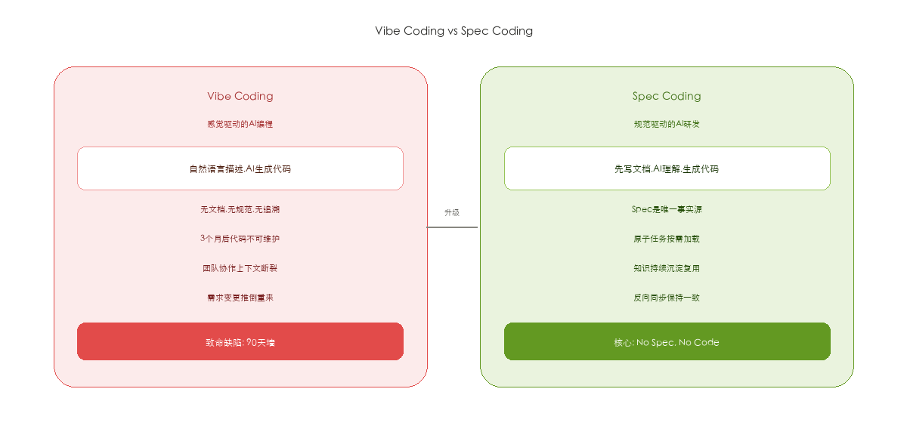

# 从 Vibe Coding 到 Spec Coding：SpecCore 重塑 AI 研发工程化

> 当 AI 编程从个人玩具走向团队协作，我们需要的不只是一个更强的模型，而是一套完整的工程纪律。

---

## 一、Vibe Coding 的甜蜜与痛苦

2025 年，Andrej Karpathy 提出了一个词——**Vibe Coding**。不用写设计文档，不用画架构图，对着 AI 说一句"帮我写一个会议室管理系统"，一个下午就能跑起来一个包含登录、CRUD、权限的完整后台。

听起来很美。直到三个月后——代码风格混乱、边界条件全部遗漏、新增需求时 AI 完全理解不了之前的逻辑。这就是我们说的**90 天墙**：Vibe Coding 的产出三个月后不可维护。

问题不在 AI 不够强。问题是**信息没有结构化**。

---

## 二、Spec Coding：让规范成为约束



**SDD（Spec-Driven Development）** 的核心主张很简单：

| 原则 | 含义 |
|:---|:---|
| **No Spec, No Code** | 没有规范文档，不准 AI 写代码 |
| **Spec is Truth** | 文档与代码不一致时，错的一定是代码 |
| **Reverse Sync** | 发现 Bug 先修文档，再修代码 |

不是让 AI 少干活，而是让 AI**在正确的时刻拿到正确的信息**，然后**把知识留下来**。

---

## 三、SpecCore 是什么

[SpecCore](https://github.com/windfallsheng/SpecCore-ts) 是一套开源的 **AI-SDD 工具链**，它是一个 CLI 工具 + AI Skill 体系，核心思想九个字：

> **宪法进规则，流程进技能，数据放项目。**

它不替代 WorkBuddy / Trae / Qcoder 等 AI IDE，而是**在这些宿主 AI 之上**提供一套规范化的研发流程。用户说话，宿主 AI 调用 speccore CLI，产出结构化的 Spec 文档。

**三层分治架构**：GLOBAL 存全局宪法和技术规范，ITERATION 存每次迭代的需求和分析，TASK 把需求拆成原子任务——每个任务的上下文只有 2K-5K tokens，远低于 AI 窗口上限。

---

## 四、一切走 ask：AI 与宿主协作

SpecCore 的工作方式不是让用户记命令，而是**让 AI 理解意图后自己拼命令**：

1. 用户说"分析 Q1 的任务001，然后制定计划"
2. `speccore ask` 输出知识库（KB）：所有可用命令和模板
3. 宿主 AI 读 KB，理解意图，拼出 `analyze --prompt -I meeting-system --task room-service` 和 `plan --prompt` 两条命令
4. 展示计划给用户确认
5. 调用 `execute_command` 逐步执行

对于复杂意图，AI 还会自动拆分为多步骤管道：**analyze → plan → split → execute**，并在关键节点暂停，等待用户确认。

---

## 五、自动模式：精确控制自动化范围

SpecCore 的自动模式不是全有或全无，而是分两级：

| 模式 | 触发词 | 行为 |
|:---|:---|:---|
| **手动** | 默认 | 每步展示结果 → 用户确认 → 下一步 |
| **部分自动** | "analyze 和 plan 自动，execute 前确认" | 前两步连续执行，execute 前暂停 |
| **全自动** | "全自动执行" / "一键完成" | 所有步骤不等确认 |

这样既保护了关键决策节点，又不让重复性步骤拖慢节奏。

---

## 六、多项目管理：从单兵到军团

SpecCore 的 GLOBAL 层是跨项目的：

```
.speccore/
  GLOBAL/
    CONSTITUTION.md        # 所有项目共享的技术宪法
    INDEX.md               # 需求跨项目目录
    PATTERNS/              # 经验模式库（只增不减）
  ITERATIONS/
    Iteration-NNN-meeting-system/    # 会议室系统迭代
    Iteration-NNN-payment/           # 支付系统迭代
```

每个模式下完一个 Feature，AI 会自动总结可复用的模式写入 PATTERNS，下次遇到类似场景会说：

> "这个登录功能我们之前做过，上次踩了 Redis 超时的坑，这次我帮你加上重试机制。"

---

## 七、实战效果

在会议室管理系统（4 个端、20+ API、7 张数据表）的完整开发中：

| 指标 | Vibe Coding | SpecCore SDD |
|:---|:---|:---|
| 分析报告 | 无 | 30 个 API + ER 图 + SQL |
| 任务拆分 | 手动 30 分钟 | `speccore split` 自动 |
| 上下文 tokens | 15-20K/次 | 2-5K/次 |
| 需求变更影响 | 不可追踪 | 反向同步，变更履历全记录 |
| 团队接手成本 | 数天阅读代码 | 读 Spec 文档即可 |

---

## 八、开源与社区

SpecCore 完全开源，MIT 协议：

- GitHub: [github.com/windfallsheng/SpecCore-ts](https://github.com/windfallsheng/SpecCore-ts)
- Gitee: [gitee.com/windfullsheng/spec-core-ts](https://gitee.com/windfullsheng/spec-core-ts)

```bash
npm install -g speccore
speccore init
speccore ask "创建会议室管理系统的第一个迭代"
```

适用场景：多端项目、团队协作、长期维护的企业级项目；不适用场景：一次性脚本、个人玩具项目。

---

## 九、写在最后

Vibe Coding 不会消失——原型阶段它依然是无敌的。但当项目进入第 2 个月、第 3 个迭代、第 5 个开发者加入时，**Spec Coding 是唯一的解法**。

不是让 AI 少干活，而是让 AI 干对活、把活干完、把知识留下。

**No Spec, No Code.**

---

*本文作者：windfallsheng，SpecCore 项目作者。文中架构图由 SpecCore + WorkBuddy AI 生成。*
