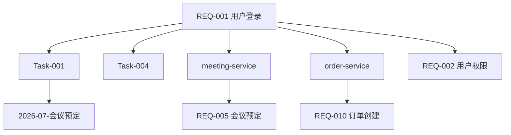

# /spec-impact - 智能变更影响分析

## 命令说明

分析指定需求（REQ-XXX）或 Task 的变更对上下游的影响范围，生成影响链报告。

**核心能力**：
1. **向上追溯**：找到依赖本需求的上游需求
2. **向下追踪**：找到本需求依赖的下游需求
3. **横向关联**：找到同一期次中的关联 Task
4. **跨项目关联**：跨项目的依赖关系

## 使用方式

### 标准命令格式
```bash
/spec-impact --req=REQ-001
/spec-impact --task=Task-001
/spec-impact --req=REQ-001 --depth=5
/spec-impact --req=REQ-001 --output=graph
```

### 自然语言格式
```bash
分析 REQ-001 变更影响
Task-001 变更会影响谁
登录接口改了会影响什么
```

## 参数说明

| 参数 | 必填 | 说明 | 示例 |
| :--- | :--- | :--- | :--- |
| `--req=<需求ID>` | 是* | 需求 ID | `--req=REQ-001` |
| `--task=<Task编号>` | 是* | Task 编号 | `--task=Task-001` |
| `--depth=<层数>` | 否 | 追溯深度，默认 3 | `--depth=5` |
| `--output=<格式>` | 否 | 输出格式：report / graph | `--output=graph` |

> *`--req` 和 `--task` 必须二选一。

## AI 执行流程

### 第一步：定位变更源

根据输入，在以下位置查找：
- `GLOBAL/INDEX.md`：查找需求 ID
- `期次-XXX/00-期次总览/PROJECT_GRAPH.md`：查找 Task

### 第二步：构建依赖图

扫描以下数据源构建依赖关系：

| 数据源 | 提取的依赖类型 |
| :--- | :--- |
| `GLOBAL/INDEX.md` | 需求 ← 项目映射 |
| `PROJECT_GRAPH.md` | Task 间依赖（上游依赖字段） |
| `GLOBAL/ARCHITECTURE.md` | 服务间调用关系 |
| `GLOBAL/PROJECTS/*/REQUIREMENT.md` | 需求间的业务关联 |
| `期次-XXX/00-期次总览/PROJECT_GRAPH.md` | 期次中 Task 的依赖链 |

### 第三步：生成影响分析报告
```markdown
🔗 变更影响分析报告

━━━━━━━━━━━━━━━━━━━━━━━━━━━━━━━━━━━━
📌 变更源
━━━━━━━━━━━━━━━━━━━━━━━━━━━━━━━━━━━━
  类型：需求变更
  ID：REQ-001
  名称：用户登录
  项目：user-service

━━━━━━━━━━━━━━━━━━━━━━━━━━━━━━━━━━━━
📊 影响链
━━━━━━━━━━━━━━━━━━━━━━━━━━━━━━━━━━━━
REQ-001（用户登录）
  ├── 项目内影响
  │   ├── Task-001 用户登录 ✅ 直接关联
  │   └── Task-004 密码重置 ✅ 直接关联
  │
  ├── 跨项目影响
  │   ├── meeting-service（会议服务）
  │   │   └── REQ-005 会议预定 ⚠️ 依赖登录态
  │   └── order-service（订单服务）
  │       └── REQ-010 订单创建 ⚠️ 依赖登录态
  │
  ├── 期次影响
  │   └── 2026-07-会议预定（🔄 进行中）🔶 需回归验证
  │
  └── 横向关联
      └── REQ-002 用户权限 📦 同项目，建议联合评审

━━━━━━━━━━━━━━━━━━━━━━━━━━━━━━━━━━━━
🚨 风险等级
━━━━━━━━━━━━━━━━━━━━━━━━━━━━━━━━━━━━
  🔴 高风险：影响 2 个外部项目，涉及 1 个进行中期次

━━━━━━━━━━━━━━━━━━━━━━━━━━━━━━━━━━━━
💡 建议
━━━━━━━━━━━━━━━━━━━━━━━━━━━━━━━━━━━━
  1. 🔴 优先通知 meeting-service 和 order-service 团队
  2. 🔴 对 2026-07-会议预定 进行回归测试
  3. 🟡 建议联合评审 REQ-001 和 REQ-002
  4. 📋 运行 /spec-sync-global 同步更新全量层
```

### 第四步：输出 Mermaid 图（`--output=graph`）

