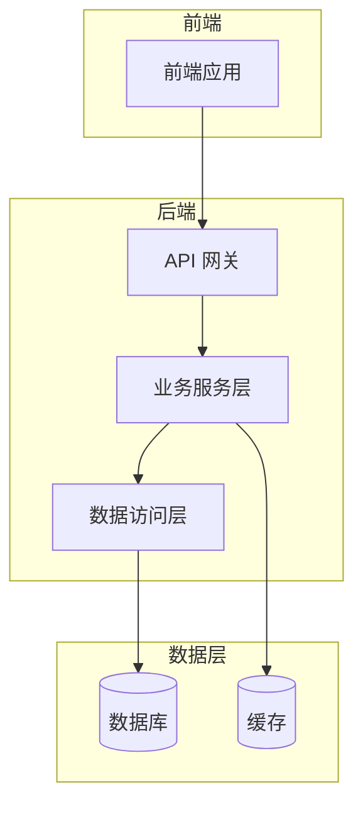

# 项目级整体架构

> 本文档描述项目级的整体架构，是跨期次的架构基准。
> 各期次的 `00-技术文档/ARCHITECTURE.md` 从此继承并特化。

## 1. 架构总览

{用 2-3 段话描述项目的整体架构思路}

## 2. 系统架构图

## 3. 技术选型

{从 `TECH_STACK.md` 继承，概述核心技术选型}

## 4. 模块划分

| 模块 | 职责 | 技术栈 | 负责人 |
| :--- | :--- | :--- | :--- |
| | | | |

## 5. 跨期次架构约束

{列出所有期次必须遵守的架构约束}

## 6. 演进规划

| 阶段 | 架构变化 | 目标期次 |
| :--- | :--- | :--- |
| 单体架构 | 当前状态 | 2026-07 |
| 服务拆分 | 微服务化 | 2026-10 |
